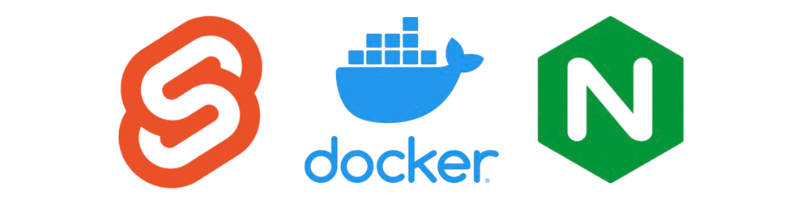
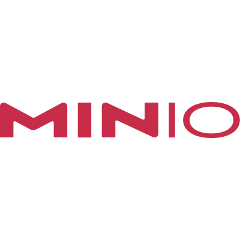
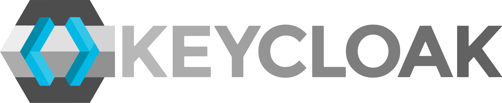

# OpenPaDi 📜

  

**Open Paleography and Diplomatics**  
**Fecha de creación:** Abril 2025

---

## Descripción

**OpenPaDi** es una plataforma colaborativa para la transcripción y consulta de textos históricos.  
Está dirigida a investigadores, estudiantes, paleógrafos, diplomáticos e historiadores, facilitando el acceso a fuentes escritas antiguas a través de un entorno digital abierto y seguro.

---

## Funcionalidades Implementadas (Versión Actual)

- **Repositorio de Documentos:** Subida y almacenamiento de documentos digitalizados (imágenes, PDFs).
- **Consulta de Documentos:** Acceso y visualización de documentos y sus metadatos.
- **Gestión de Usuarios y Autenticación:** Sistema seguro para el registro e inicio de sesión de usuarios.
- **Búsqueda Básica:** Posibilidad de buscar documentos por título.
- **API Segura:** Endpoints protegidos para la gestión de documentos.

## Funcionalidades Futuras (Visión del Proyecto)

- Transcripción colaborativa y validación de calidad.
- Espacios de discusión y formación especializada.
- Búsqueda avanzada por fecha, lugar y palabras clave dentro de las transcripciones.

---

## Principios de Funcionamiento y Arquitectura

OpenPaDi se ha desarrollado sobre una arquitectura moderna y escalable, utilizando **Kubernetes (K3s)** como plataforma de orquestación unificada para sus componentes principales. El frontend, el backend (API) y el servicio de autenticación se ejecutan como contenedores dentro de un clúster K3s, buscando garantizar disponibilidad, escalabilidad y una gestión eficiente. Los servicios de persistencia de datos (base de datos y almacenamiento de objetos) se han desplegado en máquinas virtuales dedicadas para este entorno de desarrollo y pruebas.

**Componentes Clave de la Arquitectura Actual:**

| Componente                               |                                                                              |
| :--------------------------------------- | :--------------------------------------------------------------------------: |
| **1. Clúster Kubernetes (K3s):**  <ul><li>**Orquestación:** Gestiona el ciclo de vida del frontend, la API y Keycloak.</li><li>**Nodos (Entorno de Desarrollo VirtualBox):** Un nodo master (`OP-Web-1`) que también aloja el frontend y Keycloak, y un nodo worker (`OP-API-1`) para la API.</li><li>**Descubrimiento de Servicios:** DNS interno de Kubernetes para la comunicación entre pods.</li></ul> | 

 |
| **2. Frontend (Svelte + Nginx):**  <ul><li>Interfaz de usuario (`openpadi-frontend`) construida con Svelte y servida por Nginx.</li><li>Desplegada como un `Deployment` en K3s.</li><li>Accesible externamente vía Traefik Ingress en `https://openpadi.local`.</li></ul> | 

 |
| **3. Backend API (FastAPI):**  <ul><li>Lógica de negocio (`opadi-api`), gestión de datos y comunicación con PostgreSQL y MinIO.</li><li>Desplegada como un `Deployment` en K3s (en `OP-API-1`).</li><li>Valida tokens JWT emitidos por Keycloak.</li></ul> | 

 |
| **4. Ingress Controller (Traefik):**  <ul><li>Gestiona el tráfico entrante al clúster K3s.</li><li>Enruta peticiones a `https://openpadi.local` (frontend y API vía path) y `https://auth.openpadi.local` (Keycloak).</li><li>Maneja la terminación TLS/SSL (actualmente con certificados autofirmados gestionados por Cert-Manager).</li></ul> | 

 |
| **5. Base de Datos (PostgreSQL):**  <ul><li>Almacena metadatos de documentos y la configuración de Keycloak.</li><li>Desplegada en una VM dedicada (`OP-db-primary`).</li></ul> | 

 |
| **6. Almacenamiento de Objetos (MinIO):**  <ul><li>Almacena los archivos de documentos digitalizados.</li><li>Desplegado en una VM dedicada (`OP-Storage-1`).</li></ul> | 

 |
| **7. Autenticación (Keycloak):**  <ul><li>Gestiona la identidad de los usuarios y la emisión de tokens.</li><li>Desplegado como un Pod en K3s (en `OP-Web-1`), utilizando PostgreSQL como backend.</li><li>Expuesto vía Traefik en `https://auth.openpadi.local`.</li></ul> |  

 |

**Flujo de Tráfico Simplificado:**

1.  Un usuario accede a `https://openpadi.local`.
2.  Traefik (Ingress) recibe la petición y la dirige al frontend.
3.  El frontend Svelte se carga en el navegador. Si se requiere autenticación, redirige a `https://auth.openpadi.local`.
4.  El usuario se autentica en Keycloak. Keycloak redirige de vuelta al frontend con un token.
5.  El frontend realiza peticiones a la API (`https://openpadi.local/api/...`) incluyendo el token JWT.
6.  Traefik enruta la petición a la API. La API valida el token con Keycloak (indirectamente, usando sus claves públicas) y, si es válido, procesa la petición interactuando con PostgreSQL y MinIO.
7.  La API devuelve la respuesta al frontend, que muestra la información al usuario.

Esta arquitectura proporciona una base funcional para OpenPaDi en un entorno de desarrollo/pruebas.

---

## Estado Actual del Proyecto (Entorno de Pruebas en VirtualBox)

## Servicios Desplegados y Funcionales ✅

-   **Frontend (Svelte + Nginx)** dockerizado y desplegado en K3s. ✅
-   **API (FastAPI)** dockerizada y desplegada en K3s. ✅
-   **Base de Datos (PostgreSQL)** en VM dedicada, operativa e integrada. ✅
-   **Almacenamiento de Objetos (MinIO)** en VM dedicada, operativo e integrado. ✅
-   **Ingress (Traefik)** con TLS autofirmado (vía Cert-Manager) exponiendo frontend, API y Keycloak. ✅
-   **Autenticación y Gestión de Usuarios con Keycloak:**
    -   Despliegue de Keycloak en K3s con persistencia en PostgreSQL. ✅
    -   Realm `openpadi` y clientes `openpadi-frontend` (público) y `openpadi-api` (confidencial) configurados. ✅
    -   Flujo de login/logout funcional desde el frontend. ✅
    -   API FastAPI valida tokens JWT emitidos por Keycloak para proteger sus endpoints. ✅
-   **Comunicación End-to-End:** Frontend ⇄ Keycloak ⇄ API ⇄ Base de Datos ⇄ Almacenamiento de Objetos funcionando. ✅

## Enfoque ASIR del Proyecto y Próximos Pasos de Infraestructura (Diseño para Proxmox) ⚙️

El foco principal de este proyecto es el diseño, implementación y gestión de la infraestructura de sistemas y redes (ASIR). El entorno actual en VirtualBox ha servido para desarrollar e integrar los componentes de la aplicación. Los próximos pasos se centran en la definición y (conceptualmente) la implementación de una infraestructura más robusta, segura y escalable, idealmente sobre Proxmox VE:

-   **Segmentación de Red y Seguridad Perimetral:**
    -   Diseño de VLANs (DMZ, Aplicaciones, Base de Datos, Almacenamiento, Gestión).
    -   Implementación de un firewall/router (ej. OPNsense) en una VM para gestionar el tráfico inter-VLAN y la seguridad perimetral.
-   **Servicios de Red Fundamentales:**
    -   Configuración de DHCP y DNS centralizados (gestionados por el firewall/router OPNsense) para las VMs en las diferentes VLANs.
-   **Alta Disponibilidad y Resiliencia (Conceptual):**
    -   Consideraciones para K3s multi-nodo (master y workers).
    -   Replicación de PostgreSQL.
    -   Despliegue distribuido de MinIO.
-   **Monitorización, Logging y Backups (Conceptual):**
    -   Aunque no implementados en detalle, se reconoce la necesidad de herramientas como Prometheus, Grafana, Loki y estrategias de backup para un entorno de producción.
-   **Seguridad Adicional y Hardening:**
    -   Refuerzo de la configuración de todos los componentes.

---

## Licencia

Distribuido bajo la **GNU Affero General Public License v3.0 (AGPLv3)**.

---
