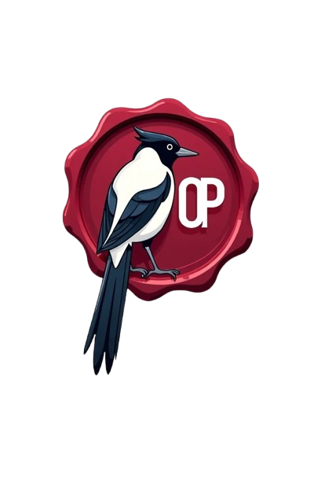
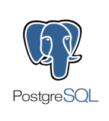
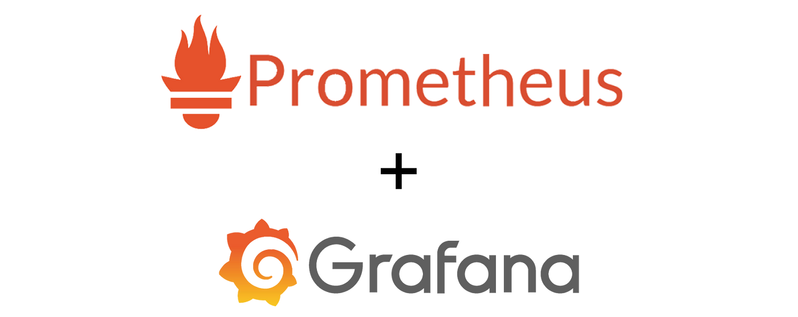

# OpenPaDi 📜

  

**Open Paleography and Diplomatics**  
**Fecha de creación:** Abril 2025

---

## Descripción

**OpenPaDi** es una plataforma colaborativa para la transcripción y consulta de textos históricos.  
Está dirigida a investigadores, estudiantes, paleógrafos, diplomáticos e historiadores, facilitando el acceso a fuentes escritas antiguas a través de un entorno digital abierto y seguro.

---

## Funcionalidades

- Repositorio de documentos digitalizados.
- Transcripción colaborativa y validación de calidad.
- Espacios de discusión y formación especializada.
- Búsqueda avanzada por fecha, lugar y palabras clave.
- Seguridad, privacidad y gestión de usuarios.

---

## Principios de Funcionamiento y Arquitectura

OpenPaDi se está diseñando sobre una arquitectura moderna y escalable, utilizando **Kubernetes (k3s)** como plataforma de orquestación unificada para todos sus componentes. Esto significa que tanto el frontend como el backend (API) se ejecutan como contenedores dentro de un clúster de Kubernetes, garantizando alta disponibilidad, escalabilidad y una gestión eficiente de los recursos.

**Componentes Clave de la Arquitectura:**

| Componente                               |                                                                              |
| :--------------------------------------- | :--------------------------------------------------------------------------: |
| **1. Clúster Kubernetes (k3s):**  <ul><li>**Orquestación:** Gestiona el ciclo de vida de las aplicaciones (frontend y API), incluyendo despliegues, escalado automático y auto-reparación.</li><li>**Nodos:** El clúster consta de nodos maestros (control-plane) y nodos trabajadores (workers) que ejecutan las cargas de trabajo. En nuestro entorno de desarrollo inicial, utilizamos máquinas virtuales (ej. `OP-Web-1` como master, `OP-API-1` como worker).</li><li>**Descubrimiento de Servicios:** Facilita la comunicación interna entre el frontend y la API mediante el DNS de Kubernetes.</li></ul> | 

 |
| **2. Frontend (opadi-frontend):**  <ul><li>La interfaz de usuario con la que interactúan los paleógrafos e investigadores.</li><li>Se empaqueta como una imagen Docker y se despliega como un `Deployment` en Kubernetes.</li><li>Accesible externamente a través de un `Ingress Controller` (como Traefik).</li></ul> | 

 |
| **3. Backend API (opadi-api):**  <ul><li>Proporciona la lógica de negocio, gestión de datos y comunicación con la base de datos.</li><li>También se empaqueta como imagen Docker y se despliega como un `Deployment` en Kubernetes.</li><li>Se comunica de forma segura y eficiente con el frontend dentro del clúster.</li></ul> | 

 |
| **4. Ingress Controller (Traefik):**  <ul><li>Gestiona el tráfico entrante al clúster, dirigiendo las peticiones de los usuarios al servicio de frontend correspondiente (ej. `https://openpadi.local`).</li><li>Maneja la terminación TLS/SSL para conexiones seguras.</li></ul> | 

 |
| **5. Base de Datos (PostgreSQL/MariaDB):**  <ul><li>Almacena los documentos, transcripciones, metadatos y datos de usuario.</li><li>Inicialmente, se plantea como un servicio externo al clúster Kubernetes para simplificar la gestión, pero con la posibilidad de integrarla en Kubernetes mediante `StatefulSets` en el futuro.</li></ul> | 

 |
| **6. Servicios de Soporte:**  <ul><li>**Monitorización (Prometheus, Grafana):** Para observar el rendimiento y estado del sistema.</li><li>**Logging (Loki):** Para la agregación y consulta centralizada de logs.</li><li>**Backups:** Para la protección de datos críticos.</li><li>**Firewall/Router (pfSense/VyOS):** Para la seguridad perimetral y enrutamiento de red.</li></ul> | 

 |

**Flujo de Tráfico Simplificado:**

1.  Un usuario accede a la URL de OpenPaDi (ej. `https://openpadi.local`).
2.  La petición llega al Ingress Controller (Traefik) dentro del clúster Kubernetes.
3.  Traefik enruta la petición al servicio del frontend.
4.  El frontend (ejecutándose en el navegador del usuario) realiza peticiones a la API (ej. `openpadi.local/api/...` o directamente al servicio interno de la API).
5.  La API procesa la petición, interactúa con la base de datos si es necesario, y devuelve la respuesta al frontend.
6.  El frontend muestra la información al usuario.

Esta arquitectura proporciona una base robusta para el desarrollo y la operación de OpenPaDi, permitiendo un crecimiento flexible y un mantenimiento simplificado.

---

## Estado

🚧 Entorno de Prueba Funcional en VirtualBox (Base):
Servicio Frontend (Svelte) dockerizado y en K3s. HECHO
Servicio API (FastAPI) dockerizado y en K3s. HECHO
Base de Datos (PostgreSQL) operativa. HECHO
Almacenamiento de Objetos (MinIO) operativo. HECHO
Ingress (Traefik) con TLS autofirmado para exponer frontend y API. HECHO
Comunicación Frontend <-> API <-> BD <-> MinIO funcionando. HECHO
Autenticación y Gestión de Usuarios con Keycloak:
Despliegue de Keycloak en K3s. HECHO
Exposición de Keycloak vía Traefik Ingress. HECHO
Configuración básica de Keycloak (realm openpadi, clientes openpadi-api y openpadi-frontend, usuario de prueba). HECHO
PENDIENTE:
Integrar API FastAPI con Keycloak: Para validar tokens JWT.
Integrar Frontend Svelte con Keycloak: Para el flujo de login/logout y envío de tokens.
Fortalecimiento de la Infraestructura (HA y Monitorización) - Aún en VirtualBox:
PENDIENTE:
Monitorización Básica (Mon-VM con Prometheus/Grafana): Desplegar y configurar.
Bases de la Alta Disponibilidad:
Nodo Worker K3s Adicional (OP-API-2).
Réplica de Base de Datos (DB-Replica para PostgreSQL).
(Considerar cómo Svelte/Traefik se benefician de workers adicionales).
Planificación y Ejecución de la Migración a Proxmox:
PENDIENTE: Esto vendrá después de consolidar más la seguridad y monitorización en VirtualBox.

---

## Licencia

Distribuido bajo la **GNU Affero General Public License v3.0 (AGPLv3)**.

---

